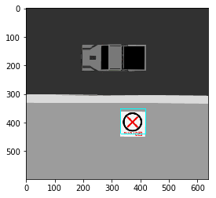
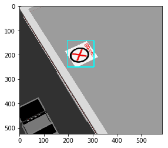

## Haar cascade classifier successfully implemented + Mark location
### by Prasant Singh


```python
# importing modules
import cv2
from matplotlib import pyplot as plt
import math
```

#### T0 find center of Rectangular mark


```python
def center(x,y,w,h):
    center_point = [x+w/2,y+h/2]
    return center_point
```

#### To find focal length of camera of drone


```python
def focal_length():
    # image width of camera may vary for different camera
    img_width=400 
    # horizontal field of view of the camera in radians of camera may vary for different camera
    hfov_rad =1.3962634 
    focal_length = (img_width/2)/math.tan(hfov_rad/2)
    return focal_length

```

### To detect Eyantra cross symbol in image


```python
def detect(image_name):
    logo_cascade = cv2.CascadeClassifier('data/cascade.xml')

    img = cv2.imread(image_name)  # Source image
    gray = cv2.cvtColor(img, cv2.COLOR_BGR2GRAY)

    # image, reject levels level weights.
    logo = logo_cascade.detectMultiScale(gray, scaleFactor=1.05)

    for (x, y, w, h) in logo:
        cv2.rectangle(img, (x, y), (x + w, y + h), (255, 255, 0), 2)
    plt.imshow(cv2.cvtColor(img, cv2.COLOR_BGR2RGB))
    plt.show()
    print("Center of mark at point: ",center(x,y,w,h)) # Calling center funtion to find center of rectangular mark
    
```

## Testing the Functions


```python
focal_length()
```


    238.35071890498833


```python
detect('test_1.png')
```





    ('Center of mark at point: ', [375, 395])


```python
detect('test_2.png')
```





    ('Center of mark at point: ', [250, 195])


```python

```
